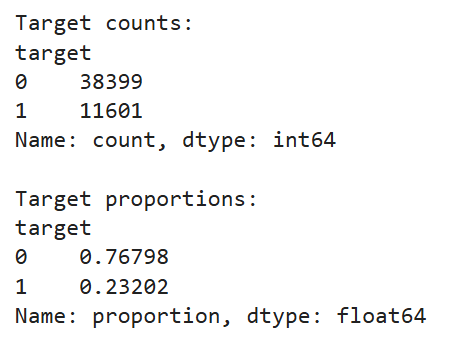
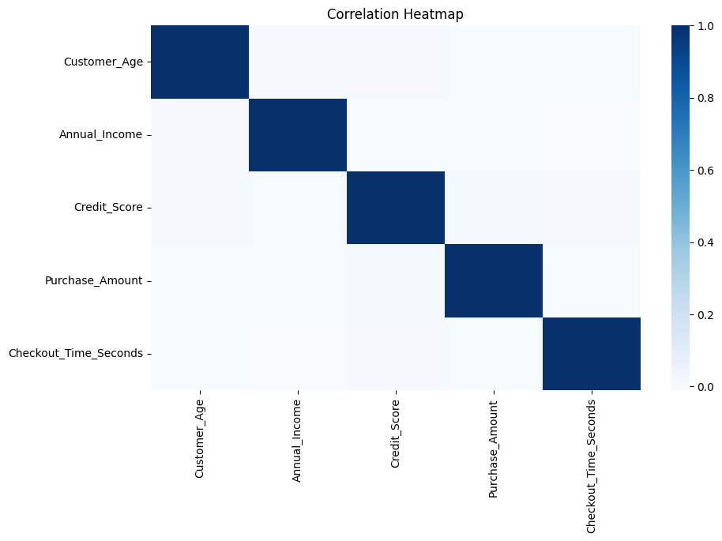
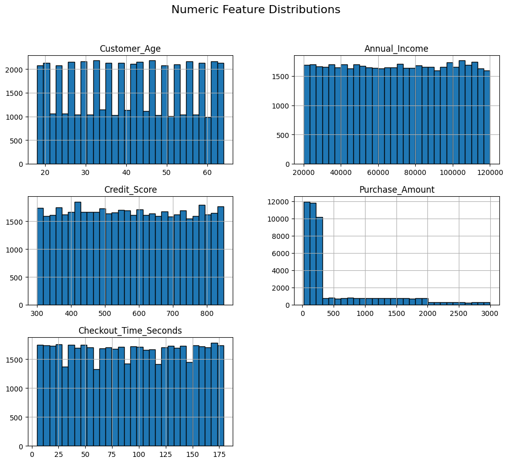
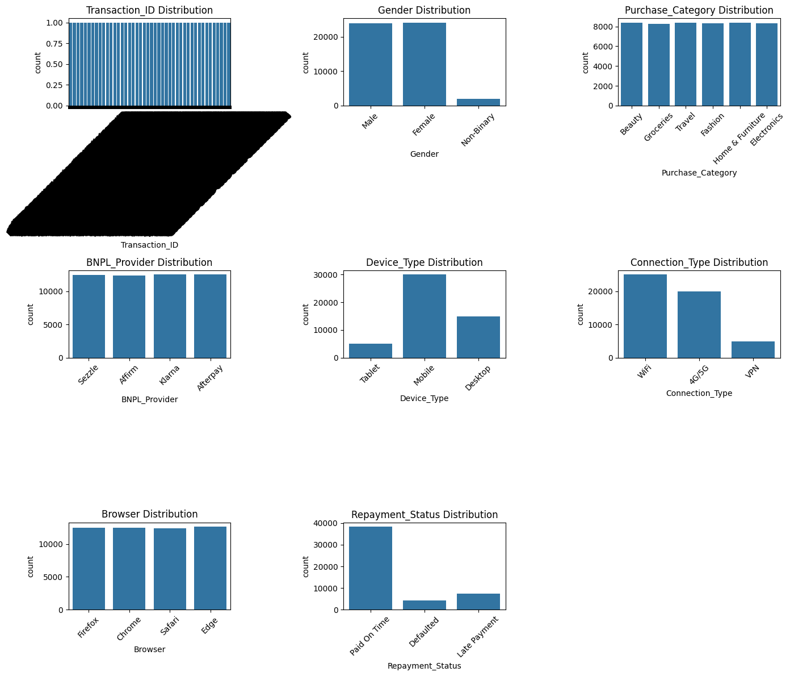
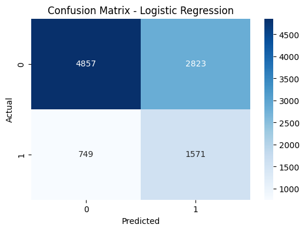
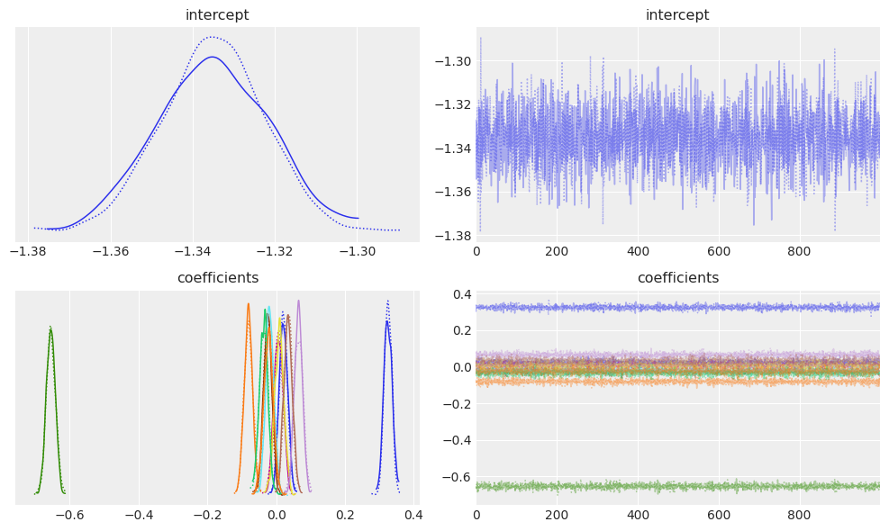
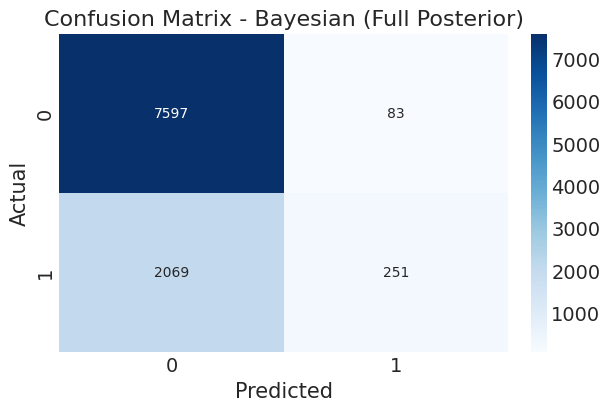

# Buy Now Pay Later (BNPL) Risk Prediction 

## 📝 Project Overview

This project focuses on identifying customers who are likely to **default or pay late** in Buy Now Pay Later (BNPL) transactions. The goal is to support **better decision-making** using both:

- 📊 Classical Machine Learning (Logistic Regression)
- 🧮 Bayesian Modeling (PyMC + NUTS inference)

By combining these approaches, we not only predict risk but also quantify **uncertainty**, which is critical in financial applications.

---

## 📂 Dataset

| Attribute | Description |
|----------|-------------|
| Size | 50,000 transactions |
| Features | 13 raw variables |
| Target | Repayment behavior (0 = Paid On Time, 1 = Late Payment/Defaulted) |
| Source | https://www.kaggle.com/datasets/bhanageviraj/buy-now-pay-later-bnpl-dataset |
 
This dataset is synthetically generated using the Faker library to simulate real-world BNPL behavior while preserving privacy.

---

## 🧹 Data Preprocessing

Key cleaning steps include:

- Removing duplicate records
- Dropping non-predictive identifiers (`Transaction_ID`)
- Handling missing values (median/mode imputation)
- Encoding target into binary format
- One-hot encoding categorical features
- Standardizing numerical variables
- Train-test split (80/20)

---
## 📊 Exploratory Data Analysis

## 🎯 Target Distribution

| Class | Meaning | Proportion |
|-------|---------|------------|
| **0** | Paid On Time | **76.8%** |
| **1** | Late Payment or Default | **23.2%** |

This class imbalance motivates careful evaluation and threshold tuning.

### 🔹 Correlation Heatmap

### 🔹 Feature Distributions

Numeric Feature Distributions:

Categorical Feature Distributions:

---

## 🛠️ Feature Engineering

After preprocessing and LASSO-based selection (10-fold CV), the final model uses **12 predictive features**:

- Customer_Age  
- Annual_Income  
- Credit_Score  
- Purchase_Amount  
- Checkout_Time_Seconds  
- BNPL_Provider_Afterpay  
- Device_Type_Mobile  
- Connection_Type_VPN  
- Connection_Type_WiFi  
- Purchase_Category_Electronics  
- Purchase_Category_Home & Furniture  
- Gender_Male

We used LASSO because it helps us automatically pick the most important features.
It removes weak or unnecessary variables by shrinking their coeffiecients to zero.
This makes the model simpler, reduces overfitting and keeps only the features that truly matter.

---

## 🤖 Modeling Approach

## 1️⃣ Logistic Regression (Baseline Model)

We used a classical logistic regression model as a benchmark.

## 📈 Model Performance Summary

| Metric | Value |
|--------|--------|
| **Accuracy** | 0.6428 |
| **ROC-AUC** | 0.7061 |

## 📉 Classification Report 

| Class | Precision | Recall | F1‑Score | Support |
|-------|-----------|--------|----------|---------|
| **0** | 0.79 | 0.99 | 0.88 | 7680 |
| **1** | 0.75 | 0.11 | 0.19 | 2320 |

The model favors recall but suffers from false positives.

### 📊 Confusion Matrix

---

# 2️⃣ Bayesian Logistic Regression (PyMC + NUTS)

A probabilistic model was built using Bayesian inference.

### 📐 Model Specification

- Priors:
  - Intercept ~ Normal(0, 5)
  - Coefficients ~ Normal(0, 2)
- Likelihood: Bernoulli (logistic link)
- Sampler: NUTS (Hamiltonian Monte Carlo)

### ✅ Diagnostics

- ✔ No divergences
- ✔ R-hat ≈ 1.00 (excellent convergence)

---

## 📊 Bayesian Insights

### 🔹 Posterior Distributions
This plot shows the posterior density curves and trace plots for both the intercept and model coefficients.  
It helps verify convergence and visualize uncertainty in the Bayesian logistic regression model.

### 🔹 Coefficient Effects

| Feature | Effect on Default Risk |
|---------|-------------------------|
| **Credit Score** | ↓ Strong decrease |
| **VPN Usage** | ↑ Strong increase |
| **Income** | ↓ Decrease |
| **WiFi Usage** | ↓ Decrease |
| **Afterpay** | ↑ Slight increase |
| **Mobile Device** | ↑ Slight increase |

## 📈 Model Performance Summary

| Metric | Value |
|--------|--------|
| **Accuracy** | 0.7848 |
| **ROC-AUC** | 0.7058|

## 📉 Classification Report 

| Class | Precision | Recall | F1‑Score | Support |
|-------|-----------|--------|----------|---------|
| **0** | 0.79 | 0.99 | 0.88 | 7680 |
| **1** | 0.75 | 0.11 | 0.19 | 2320 |

The model favors recall but suffers from false positives.

### 📊 Confusion Matrix

---

## 📈 Model Comparison

| Model | Strengths | Weaknesses |
|------|-----------|-------------|
| Logistic Regression | Fast, interpretable | High false positives |
| Bayesian Model | Uncertainty-aware, robust | Computationally expensive |

The Classical and Bayesian logistic models show the same direction of feature effects but the Bayesian version shrinks coefficients toward zero, giving more stable and uncertainty-aware estimates.

---

## 📌 Conclusion

- Credit score is the strongest predictor of default risk
- VPN usage significantly increases risk probability
- Income and stable network usage reduce risk
- Bayesian modeling provides **uncertainty-aware decision-making**

Overall, while the classical model provides strong interpretability and competitive performance, the Bayesian framework offers additional advantages through uncertainty quantification and more stable parameter estimation. This is especially valuable in financial risk modeling where understanding uncertainty is critical for informed decision-making.

---

## 👥 Contributors

- 👤 [Saung Hnin Phyu](https://github.com/Saung210)
- 👤 [Samara Pires](https://github.com/samarapires-ml)
- 👤 [Anna Tam Ly](https://github.com/atn-ly)  
